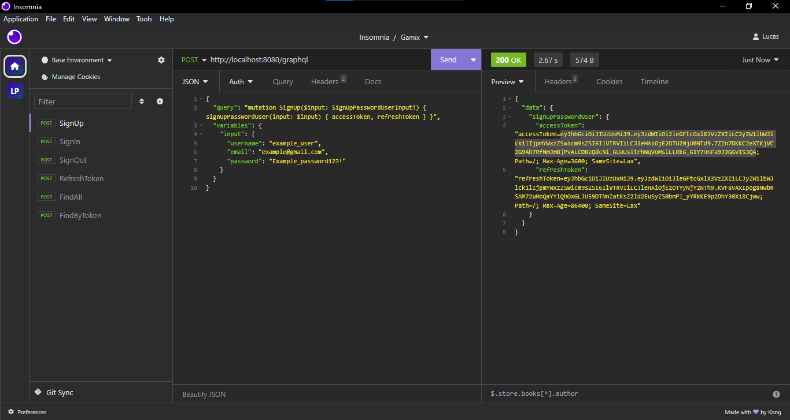
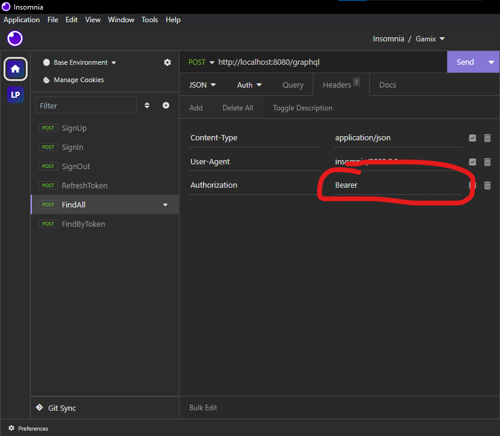
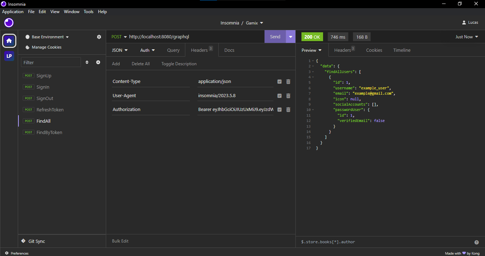

# API Usage Documentation

## Sumário

- [API Usage Documentation](#api-usage-documentation)
  - [Sumário](#sumário)
  - [1. Introdução](#1-introdução)
    - [1.1 Atenção!](#11-atenção)
  - [2. Autenticação](#2-autenticação)
    - [2.1 SignUp (Cadastro)](#21-signup-cadastro)
    - [2.2 SignIn (Login)](#22-signin-login)
    - [2.3 SignOut (Logout)](#23-signout-logout)
    - [2.4 RefreshToken](#24-refreshtoken)
  - [3. Usuários](#3-usuários)
    - [3.1 Listar Usuários](#31-listar-usuários)
    - [3.2 Encontrar Usuário por Nome de Usuário](#32-encontrar-usuário-por-nome-de-usuário)
    - [3.3 Encontrar Usuário por E-mail](#33-encontrar-usuário-por-e-mail)
    - [3.4 Atualizar Usuário](#34-atualizar-usuário)
    - [3.5 Excluir Conta](#35-excluir-conta)
  - [Contato](#contato)

---

## 1. Introdução

Este documento descreve os endpoints disponíveis na API do sistema, juntamente com os métodos HTTP permitidos e os detalhes de autenticação e parâmetros necessários para cada um deles.

### 1.1 Atenção!

Existem métodos que precisam do header Authorization: "Bearer accessToken", fique atento!





## 2. Autenticação

### 2.1 SignUp (Cadastro)

- **Endpoint**: `/auth/signup`
- **Método**: `POST`
- **Descrição**: Cria um novo usuário com as credenciais fornecidas.
- **Parâmetros**:
  - `username` (String, obrigatório): Nome de usuário do novo usuário.
  - `email` (String, obrigatório): Endereço de e-mail do novo usuário.
  - `password` (String, obrigatório): Senha do novo usuário.
- **Retorno**:
  - `accessToken` (String): Token de acesso JWT.
  - `refreshToken` (String): Token de atualização JWT.

```json
{
  "username": "example_user",
  "email": "example@gmail.com",
  "password": "Example_password123!"
}
```

### 2.2 SignIn (Login)

- **Endpoint**: `/auth/signin`
- **Método**: `POST`
- **Descrição**: Autentica um usuário com as credenciais fornecidas, e-mail e senha ou username e senha.
- **Parâmetros**:
  - `username` (String): Nome de usuário do usuário.
  - `email` (String): Endereço de e-mail do usuário.
  - `password` (String, obrigatório): Senha do usuário.
  - `rememberMe` (Boolean, obrigatório): Define se o usuário deseja permanecer logado.
- **Retorno**:
  - `accessToken` (String): Token de acesso JWT.
  - `refreshToken` (String): Token de atualização JWT.

```json
{
  "username": "example_user",
  "password": "Example_password123!",
  "rememberMe": true
}
```

### 2.3 SignOut (Logout)

- **Endpoint**: `/auth/signout`
- **Método**: `POST`
- **Descrição**: Invalida os tokens de acesso e atualização do usuário.
- **Parâmetros**:
  - `accessToken` (String, obrigatório): Token de acesso JWT.
  - `refreshToken` (String, obrigatório): Token de atualização JWT.
- **Retorno**:
  - `success` (Boolean): Indica se o logout foi bem-sucedido.

```json
{
  "accessToken": "your_access_token_here",
  "refreshToken": "your_refresh_token_here"
}
```

### 2.4 RefreshToken

- **Endpoint**: `/auth/refreshtoken`
- **Método**: `POST`
- **Descrição**: Atualiza o token de acesso expirado do usuário.
- **Parâmetros**:
  - `refreshToken` (String, obrigatório): Token de atualização JWT.
- **Retorno**:
  - `accessToken` (String): Novo token de acesso JWT.
  - `refreshToken` (String): Novo token de atualização JWT.

```json
{
  "refreshToken": "your_refresh_token_here"
}
```

## 3. Usuários

### 3.1 Listar Usuários

- **Endpoint**: `/graphql`
- **Método**: `POST`
- **Descrição**: Lista os usuários cadastrados no sistema.
- **Requisitos do Header**:
  - `Authorization` (String, obrigatório): Token de acesso JWT.
- **Parâmetros**:
  - `skip` (Int): Número de registros a serem ignorados (opcional).
  - `limit` (Int): Número máximo de registros a serem retornados (opcional).
- **Retorno**:
  - `users` (Array de Objetos User): Lista de usuários.
  
```json
{
  "query": "query FindAllUsers($skip: Int, $limit: Int) { findAllUsers(skip: $skip, limit: $limit) { id username email icon passwordUser { id verifiedEmail } } }",
  "variables": {
    "skip": 0,
    "limit": 10
  }
}
```

### 3.2 Encontrar Usuário por Nome de Usuário

- **Endpoint**: `/graphql`
- **Método**: `POST`
- **Descrição**: Encontra um usuário pelo nome de usuário.
- **Requisitos do Header**:
  - `Authorization` (String, obrigatório): Token de acesso JWT.
- **Parâmetros**:
  - `username` (String, obrigatório): Nome de usuário do usuário.
- **Retorno**:
  - `user` (Objeto User): Usuário encontrado.

```json
{
  "query": "query FindUserByUsername($username: String!) { findUserByUsername(username: $username) { id, username, email, icon } }",
  "variables": {
    "username": "example_user"
  }
}
```

### 3.3 Encontrar Usuário por E-mail

- **Endpoint**: `/graphql`
- **Método**: `POST`
- **Descrição**: Encontra um usuário pelo endereço de e-mail.
- **Requisitos do Header**:
  - `Authorization` (String, obrigatório): Token de acesso JWT.
- **Parâmetros**:
  - `email` (String, obrigatório): Endereço de e-mail do usuário.
- **Retorno**:
  - `user` (Objeto User): Usuário encontrado.

```json
{
  "query": "query FindUserByEmail($email: String!) { findUserByEmail(email: $email) { id, username, email, icon } }",
  "variables": {
    "email": "example@gmail.com"
  }
}
```

### 3.4 Atualizar Usuário

- **Endpoint**: `/graphql`
- **Método**: `POST`
- **Descrição**: Atualiza as informações de um usuário existente.
- **Requisitos do Header**:
  - `Authorization` (String, obrigatório): Token de acesso JWT.
- **Parâmetros**:
  - `input` (Objeto PartialUserInput: (username: String), (icon: String)): Objeto contendo os campos a serem atualizados (opcional).
- **Retorno**:
  - `user` (Objeto User): Usuário atualizado.

```json
{
  "query": "mutation UpdateUser($input: PartialUserInput!) { updateUser(input: $input) { id, username, email, icon } }",
  "variables": {
    "input": {
      "username": "new_username",
      "icon": "new_icon_url.png"
    }
  }
}
```

### 3.5 Excluir Conta

- **Endpoint**: `/graphql`
- **Método**: `POST`
- **Descrição**: Exclui a conta de um usuário.
- **Requisitos do Header**:
  - `Authorization` (String, obrigatório): Token de acesso JWT.
- **Retorno**:
  - `success` (Boolean): Indica se a conta foi excluída com sucesso.

```json
{
  "query": "mutation DeleteAccount { deleteAccount }"
}
```

## Contato

Para dúvidas ou sugestões relacionadas ao Back-end Gamix, entre em contato com o time de desenvolvimento responsável:

- [Gabriel Vicente - Sênior Back-end](https://github.com/gabrielOliv1)
- [Lucas Christian - Engenheiro de Software](https://github.com/Lucas-Christian)

Agradecemos por ser parte da comunidade Gamix e por contribuir para a construção de projetos de jogos emocionantes!

---

© 2023 Gamix. Todos os direitos reservados.
