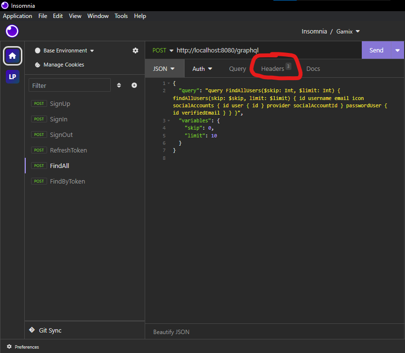

# API Usage Documentation

## Sumário

- [API Usage Documentation](#api-usage-documentation)
  - [Sumário](#sumário)
  - [1. Introdução](#1-introdução)
    - [1.1 Atenção!](#11-atenção)
  - [2. Autenticação](#2-autenticação)
    - [2.1 SignUp (Cadastro)](#21-signup-cadastro)
    - [2.2 SignIn (Login)](#22-signin-login)
  - [3. Utilizando o sistema](#3-utilizando-o-sistema)
  - [4. Usuários](#4-usuários)
    - [4.1 Encontrar Usuário por Nome de Usuário](#41-encontrar-usuário-por-nome-de-usuário)
    - [4.2 Encontrar Usuário por E-mail](#42-encontrar-usuário-por-e-mail)
    - [4.3 Excluir Conta](#43-excluir-conta)
  - [5. Posts](#5-posts)
    - [5.1 Criar Postagem](#51-criar-postagem)
    - [5.2 Listar posts](#52-listar-posts)
    - [5.3 Encontrar post por Id](#53-encontrar-post-por-id)
    - [5.4 Encontrar post por título](#54-encontrar-post-por-título)
    - [5.5 Atualizar postagem](#55-atualizar-postagem)
    - [5.6 Excluir postagem](#56-excluir-postagem)
  - [Contato](#contato)

---

## 1. Introdução

Este documento descreve os endpoints disponíveis na API do sistema, juntamente com os métodos HTTP permitidos e os detalhes de autenticação e parâmetros necessários para cada um deles.

### 1.1 Atenção!

Existem métodos que precisam do header Authorization: "Bearer accessToken", fique atento!
Esse Header é retornado em todos os métodos uma vez que está logado, caso faltem 20 minutos para expirar o token, o novo token é retornado no header.




## 2. Autenticação

### 2.1 SignUp (Cadastro)

- **Endpoint**: `/auth/signup`
- **Método**: `POST`
- **Descrição**: Cria um novo usuário com as credenciais fornecidas.
- **Parâmetros**:
  - `username` (String, obrigatório): Nome de usuário do novo usuário.
  - `email` (String, obrigatório): Endereço de e-mail do novo usuário.
  - `password` (String, obrigatório): Senha do novo usuário.
- **Retorno**:
  - `Header "Authorization: Bearer accessToken"` (String): Token de acesso JWT.

```json
{
  "username": "example_user",
  "email": "example@gmail.com",
  "password": "Example_password123!"
}
```

### 2.2 SignIn (Login)

- **Endpoint**: `/auth/signin`
- **Método**: `POST`
- **Descrição**: Autentica um usuário com as credenciais fornecidas, e-mail e senha ou username e senha.
- **Parâmetros**:
  - `username` (String): Nome de usuário do usuário.
  - `email` (String): Endereço de e-mail do usuário.
  - `password` (String, obrigatório): Senha do usuário.
  - `rememberMe` (Boolean, obrigatório): Define se o usuário deseja permanecer logado.
- **Retorno**:
  - `Header "Authorization: Bearer accessToken"` (String): Token de acesso JWT.

```json
{
  "username": "example_user",
  "password": "Example_password123!",
  "rememberMe": true
}
```

## 3. Utilizando o sistema

O restante do sistema é GraphQL, e temos algumas coisas em comum para todas as funcionalidades do GraphQL:
- **Endpoint**: `/graphql`
- **Método**: `POST`
- **Requisitos do Header**:
  - `Authorization` (String, obrigatório): Token de acesso JWT.
  
## 4. Usuários

### 4.1 Encontrar Usuário por Nome de Usuário

- **Descrição**: Encontra um usuário pelo nome de usuário.
- **Parâmetros**:
  - `username` (String, obrigatório): Nome de usuário do usuário.
- **Retorno**:
  - `user` (Objeto User): Usuário encontrado.

```json
{
  "query": "query FindUserByUsername($username: String!) { findUserByUsername(username: $username) { id, username, email, icon } }",
  "variables": {
    "username": "example_user"
  }
}
```

### 4.2 Encontrar Usuário por E-mail

- **Descrição**: Encontra um usuário pelo endereço de e-mail.
- **Parâmetros**:
  - `email` (String, obrigatório): Endereço de e-mail do usuário.
- **Retorno**:
  - `user` (Objeto User): Usuário encontrado.

```json
{
  "query": "query FindUserByEmail($email: String!) { findUserByEmail(email: $email) { id, username, email, icon } }",
  "variables": {
    "email": "example@gmail.com"
  }
}
```

### 4.3 Excluir Conta

- **Descrição**: Exclui a conta de um usuário.
- **Retorno**:
  - `success` (Boolean): Indica se a conta foi excluída com sucesso.

```json
{
  "query": "mutation DeleteAccount { deleteAccount }"
}
```

## 5. Posts

### 5.1 Criar Postagem

- **Descrição**: Cria uma nova postagem.
- **Parâmetros**: (Objeto PartialPostInput: (authorId: Int!), (title: String), (content: String)): Objeto contendo os campos a serem atualizados (opcional).
- **Retorno**:
  - `sucess` (Objeto Post): Post criado.
 
```json
{
    "query": "mutation CreatePost($input: PartialPostInput!) { createPost(input: $input) { author { id displayName } title content }}",
    "variables": {
        "input": {
            "authorId": 1,
            "title": "Novo projeto em andamento",
            "content": "Abludaldnadnauydau"
        }
    }
}
```

### 5.2 Listar posts

- **Descrição**: Lista todas postagens.
- **Parâmetros**:
  - `skip` (Int): Número de registros a serem ignorados (opcional).
  - `limit` (Int): Número máximo de registros a serem retornados (opcional).
- **Retorno**:
  - `sucess` (List<Post>): Lista de todos os posts criados.
 
```json
{
    "query": "query FindAllPosts($skip: Int, $limit: Int) { findAllPosts(skip: $skip, limit: $limit) { id author { id displayName } title content }}",
    "variables": {
        "skip": 0,
        "limit": 10
    }
}
```

### 5.3 Encontrar post por Id

- **Descrição**: Lista todas postagens.
- **Parâmetros**:
  - `id` (Int): Id do post a ser recuperado.
- **Retorno**:
  - `sucess` (Objeto Post): Post recuperado.
 
```json
{
    "query": "query FindPostById($id: Int!) { findPostById(id: $id) { author { id displayName } title content }}",
    "variables": {
        "id": 1
    }
}
```

### 5.4 Encontrar post por título

- **Descrição**: Lista todas postagens.
- **Parâmetros**:
  - `title` (String): Título do post a ser recuperado.
- **Retorno**:
  - `sucess` (Objeto Post): Post recuperado.
 
```json
{
    "query": "query FindPostByTitle($title: String!) { findPostByTitle(title: $title) { id author { displayName } title content }}",
    "variables": {
        "title": "Novo projeto em andamento"
    }
}
```

### 5.5 Atualizar postagem

- **Descrição**: Lista todas postagens.
- **Parâmetros**:
  - `postId` (Int, obrigatório): Id do post a ser atualizado.
  - `input`: (Objeto PartialPostInput): Indica os campos e valores que deverão ser atualizados. 
- **Retorno**:
  - `sucess` (Objeto Post): Post atualizado.
 
```json
{
    "query": "mutation UpdatePost($postId: Int!, $input: PartialPostInput!) { updatePost(postId: $postId, input: $input) { id author { id displayName } title content }}",
    "variables": {
        "postId": 1,
        "input": {
            "authorId": 1,
            "title": "Meu novo projeto v1.0"
        }
    }
}
```

### 5.6 Excluir postagem

- **Descrição**: Lista todas postagens.
- **Parâmetros**:
  - `postId` (Int, obrigatório): Id do post a ser excluído.
- **Retorno**:
  - `sucess` (Boolean): Indica se a exclusão foi feita corretamente.
 
```json
{
    "query": "mutation DeletePost($postId: Int!) { deletePost(postId: $postId) }",
    "variables": {
        "postId": 1
    }
}
```

## Contato

Para dúvidas ou sugestões relacionadas ao Back-end Gamix, entre em contato com o time de desenvolvimento responsável:

- [Gabriel Vicente - Sênior Back-end](https://github.com/gabrielOliv1)
- [Lucas Christian - Engenheiro de Software](https://github.com/Lucas-Christian)

Agradecemos por ser parte da comunidade Gamix e por contribuir para a construção de projetos de jogos emocionantes!

---

© 2023 Gamix. Todos os direitos reservados.
