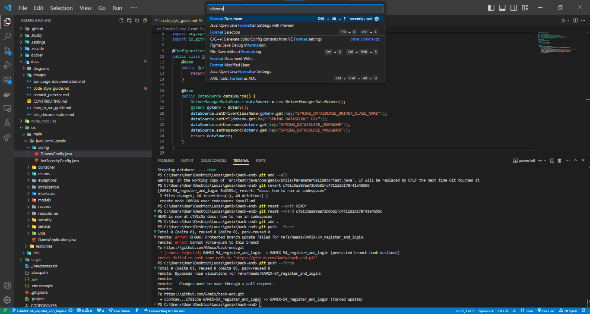

# Guia de Estilo de Código - Back-end Gamix (Java)

Neste projeto, seguimos um guia de estilo de código para manter a consistência e a legibilidade em todo o código Back-end. Essas diretrizes ajudarão a garantir que todos os desenvolvedores possam colaborar efetivamente e compreender facilmente o código.

Para deixar o código formatado de acordo com os padrões do Gamix pode apertar Ctrl + Shift + P no seu VSCode e usar o comando `Format Document`:

Observação: caso esteja utilizando outro editor, encontre essa respectiva função nele e formate de acordo com o padrão estabelecido no `.vscode/gamix_style.xml`.

## Formatação de Código

- Use indentação com 4 espaços para cada nível de recuo.
- Evite linhas de código com mais de 100 caracteres.
- Use linhas em branco para separar blocos lógicos de código.
- Use espaços em branco para separar operadores e expressões.
- Evite o uso de espaços em branco em excesso.

## Nomes de Variáveis e Funções

- Use nomes descritivos e significativos para variáveis e funções.
- Utilize camelCase para nomes de variáveis e funções (por exemplo, `nomeDaVariavel`, `calcularTotal`).

## Comentários

- Use comentários para explicar o código complexo ou partes que possam ser confusas para outros desenvolvedores.
- Mantenha os comentários atualizados e relevantes. Comentários desatualizados podem levar a confusões.

## Importações

- Mantenha as importações organizadas e agrupadas por pacote.
- Evite importar classes que não são usadas no código.

## Estrutura de Diretórios

A estrutura de diretórios a seguir é comum em projetos Java que utilizam o framework Spring Boot. Ela ajuda a organizar o código-fonte de maneira lógica e modular.

- `src/`: O diretório de origem (source) do projeto, onde fica o código-fonte.

- `main/`: Contém o código de produção do aplicativo.

- `test/`: Contém todos os códigos de testes do aplicativo.

- `resources/graphql`: Contém o schema da aplicação, onde serão definidos todas as Queries, Mutations e etc.

- `java/`: Armazena o código Java da aplicação.

- `com/`: Prefixo de pacote para evitar conflitos de nome. Indica uma organização, como "com.gamix".

- `gamix/`: Pacote da aplicação, onde você coloca as classes relacionadas.

Dentro do pacote `com.gamix`, a estrutura padrão do projeto Spring Boot inclui:
- `config/`: Classes que realizam configurações importantes, como o spring security.

- `controller/`: Classes que recebem requisições HTTP e direcionam para operações no serviço.

- `enums/`: Enums que contenham dados relevantes e que devem ser consistentes, como o tempo de expiração de tokens de acesso.

- `exceptions/`: Classes com suas respectivas exceções.

- `initialization/`: Classes que precisam ser executadas logo após a inicialização.

- `interfaces/`: Interfaces que serão implementadas por outras classes ficam aqui.

- `models/`: Classes que representam entidades do domínio, mapeando para tabelas no banco de dados.

- `records/`: Records de inputs e outros tipos de dados de entrada e saída ficam aqui.

- `repositories/`: Interfaces ou classes que definem como acessar dados no banco de dados.

- `security/`: Classes relacionadas com a segurança por exemplo classes relacionadas com a autenticação JWT.

- `service/`: Lógica de negócios da aplicação, interagindo com repositórios.

- `utils/`: Classes utilitárias que podem ser usadas em diversas situações e não tem uma categoria específica.

## Tratamento de Exceções

- Sempre trate exceções de forma adequada e forneça mensagens de erro úteis para facilitar a depuração.
- Evite capturar exceções genéricas, especifique exceções específicas sempre que possível.

## Exemplo de Código

UserController.java:
```java
@RequiredArgsConstructor
@RestController
@RequestMapping("/auth")
public class AuthController {
    private final AuthService authService;

    @PostMapping("/signup")
    public ResponseEntity<Object> signUpPasswordUser(
            @RequestBody SignUpUserInput signUpUserInput
    ) throws ExceptionBase {
        try {
            SessionReturn session = authService.signUpPasswordUser(signUpUserInput);

            return ResponseEntity.ok()
                    .header("Authorization", "Bearer " + session.getToken())
                    .body(session);
        } catch (ExceptionBase ex) {
            return throwError(ex);
        }
    }

    @PostMapping("/signin")
    public ResponseEntity<Object> signInPasswordUser(
            @RequestBody SignInUserInput signInUserInput,
            HttpServletRequest req) throws ExceptionBase {
        try {
            SessionReturn session = authService.signInPasswordUser(signInUserInput);

            return ResponseEntity.ok()
                    .header("Authorization", "Bearer " + session.getToken())
                    .body(session);
        } catch (ExceptionBase ex) {
            return throwError(ex);
        }
    }
}
```
Schema.graphqls:
```graphqls
type Query {
    user: [User]
}

type Mutation {
    addUser(user: UserInput): User
}

type User {
    id: ID!
    name: String!
}

input UserInput {
    name: String!
}
```

## Contato

Se você tiver dúvidas ou precisar de assistência com as diretrizes de estilo de código, entre em contato com o time de desenvolvimento responsável pelo Back-end:

- [Gabriel Vicente - Sênior Back-end](https://github.com/gabrielOliv1)
- [Lucas Christian - Engenheiro de Software](https://github.com/Lucas-Christian)

Obrigado por contribuir para a plataforma Gamix e ajudar a criar jogos incríveis para nossa comunidade!

---

© 2023 Gamix. Todos os direitos reservados.
